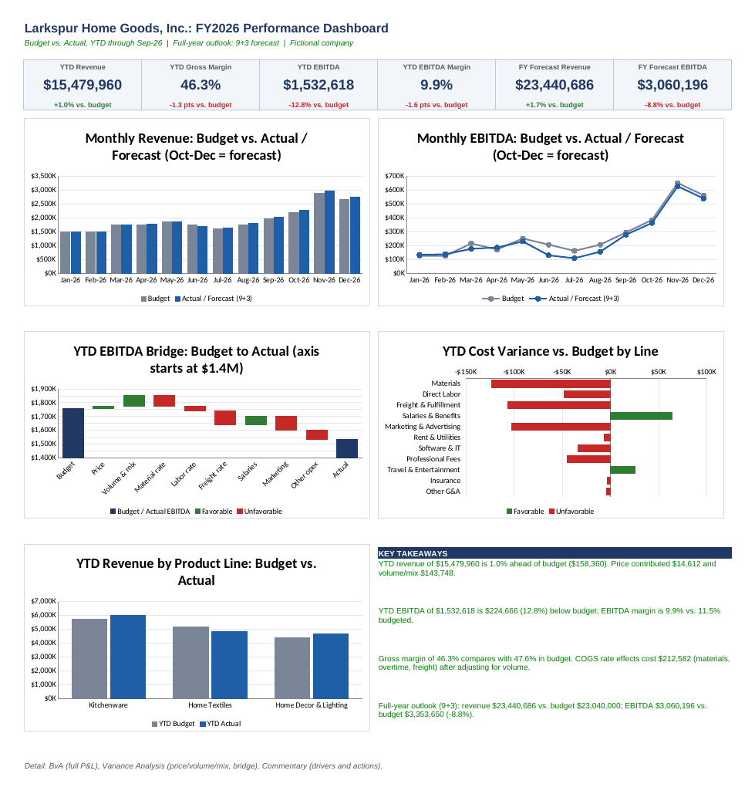

# FP&A Budget vs. Actual + Rolling Forecast

A driver-based FP&A model and management dashboard for **Larkspur Home Goods, Inc.**, a fictional ~$23M home goods company. Built in Excel, with a star-schema data model and DAX measures for Power BI.

All data is simulated. No real company's financials are used.

## What it does

- **12-month P&L** by month: units, revenue by product line, COGS (materials, direct labor, freight), eight operating expense lines, gross profit, EBITDA.
- **Driver-based budget**: units x price by product, seasonality curve, standard cost per unit, % of revenue and fixed-cost drivers.
- **Budget vs. Actual** for any closed month, year-to-date, and full year, with variance $, variance %, favorable/unfavorable status and a materiality flag (5% and $25K).
- **Variance analysis**: revenue price / volume / mix, flexed-budget COGS (volume vs. rate effects), and an EBITDA bridge that reconciles to zero.
- **Variance commentary**: driver type, root cause and forecast treatment for each line.
- **9+3 rolling forecast**: closed months pull actuals; open months are re-forecast from levers informed by the Q3 run-rate.
- **Management dashboard**: KPI tiles, trend charts, EBITDA bridge, cost variance chart, auto-written takeaways.

## Headline results (YTD September FY2026)

| | Budget | Actual | Variance |
|---|---|---|---|
| Revenue | $15.32M | $15.48M | +$158K (+1.0%) |
| Gross margin | 47.6% | 46.3% | -1.3 pts |
| EBITDA | $1.76M | $1.53M | -$225K (-12.8%) |
| FY EBITDA (budget vs. 9+3 forecast) | $3.35M | $3.06M | -$293K (-8.8%) |

Revenue is ahead of plan but EBITDA is behind: $213K of unfavorable COGS rate effects (cotton cost inflation, overtime, freight surcharges and expediting after a supplier delay) and $103K of marketing overspend more than offset the volume gain.

## Files

| File | Contents |
|---|---|
| `FPA_Budget_vs_Actual_Forecast_Model.xlsx` | The model: Dashboard, BvA, Variance Analysis, Commentary, Forecast, Budget, Actuals, Assumptions, plus 7 `pbi_` tables |
| `powerbi/PowerBI_Build_Guide.md` | Step-by-step Power BI build: data model, measures, 4 report pages, validation numbers |
| `powerbi/measures.dax` | 44 DAX measures |
| `powerbi/Larkspur_FPA_theme.json` | Report theme |
| `powerbi/csv/` | Fact and dimension tables as CSV |

## Skills demonstrated

**Excel**: driver-based modeling, input/formula separation with color coding, INDEX / SUMPRODUCT period selection, dynamic actual-vs-forecast switch, flexed budgets, price/volume/mix, waterfall chart built from stacked columns, reconciliation checks, conditional formatting.

**Power BI**: star schema with two fact tables and conformed dimensions, DAX (CALCULATE, KEEPFILTERS, SUMX with context transition, sign-aware variance), drill-down waterfall, conditional formatting by measure.

**FP&A**: budget build, month-end variance analysis and commentary, materiality thresholds, re-forecasting, executive summary writing.
